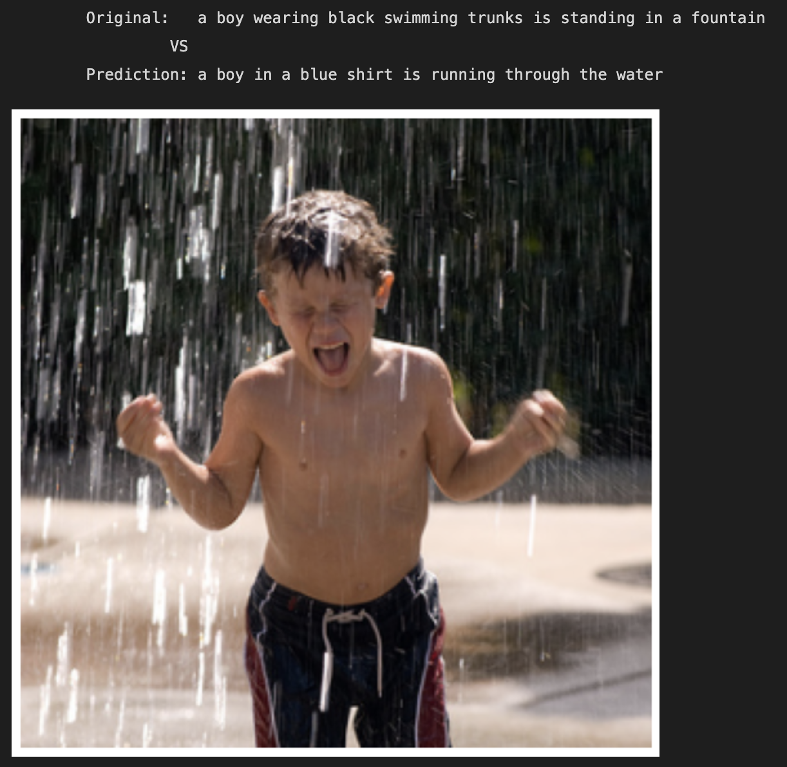
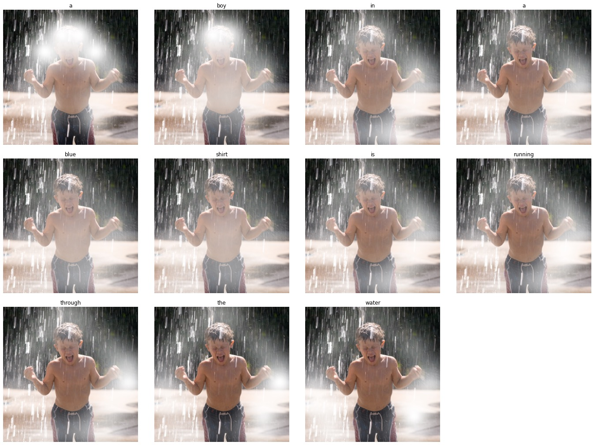

# Image Captioning
Результат работы над заданием на кафедре РИОТ МФТИ по созданию модели для решения задачи Image Captioning

Использовался датасет Flickr8k для обучения и оценки модели

В качестве учебного задания было реализованы две модели на основе inception_v3 в связке с LSTM. Во второй модели для улучшения результатов был использован Attention

## Вкратце о результатах
1. Модель с применением Attention показала более стабильные и хорошие результаты даже в условиях малого количества обучающих примеров

|                      | BLEU 4 |
|----------------------|--------|
| Модель без Attention | 0.0    |
| Модель с Attention   | 0.18   |

2. Удалось визуализировать attention-маски при генерации различных слов в описании изображения, чтобы понять, на что именно ориентируется модель при генерации слов

3. Удалось применить немного разные идеи использования Attention и сравнить их сложность и эффект

## ToDo
 * Разбить ноутбук на `.py` файлы (сделать мини-пакет)
 * Добавить Pytorch-Lightning для обучения
 * Визуализировать результаты в этом ноутбуке
 * Подробнее рассказать о результатах работы
